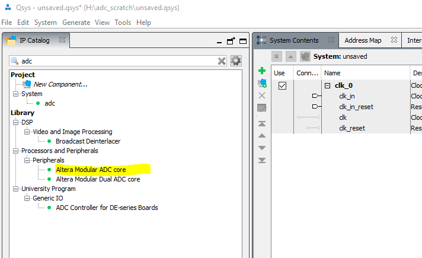
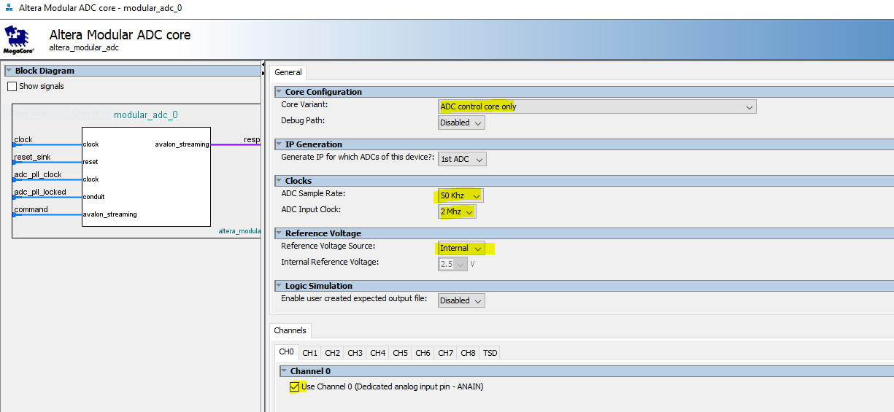
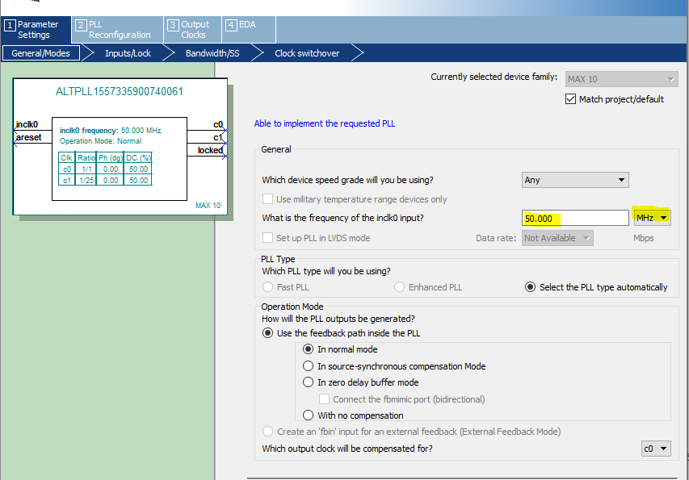
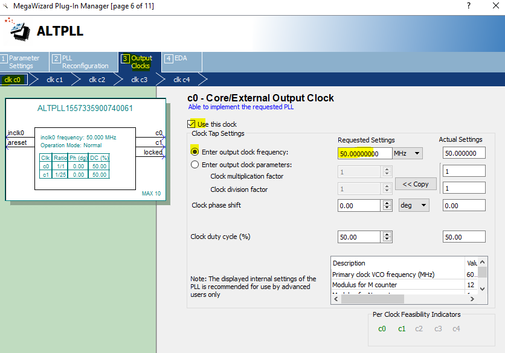
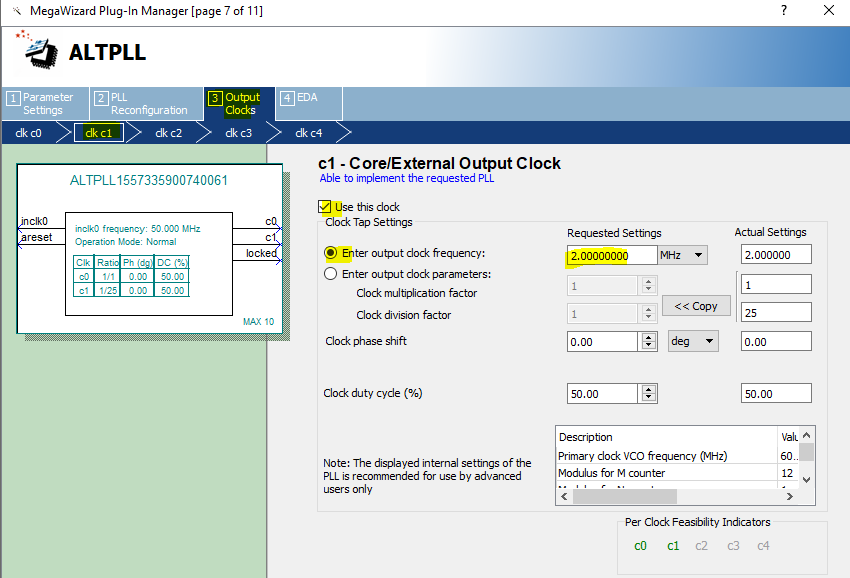
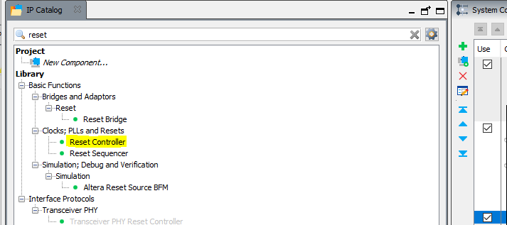
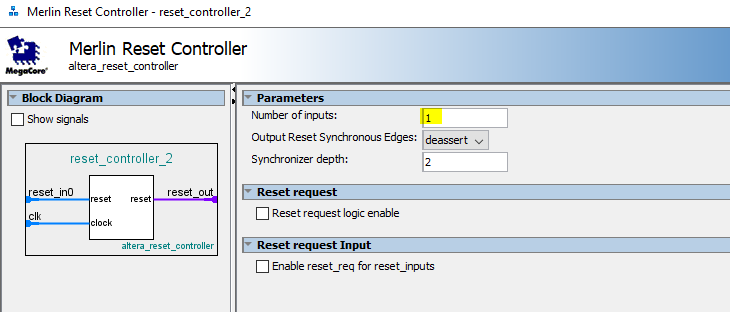
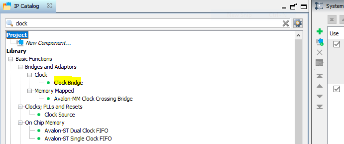
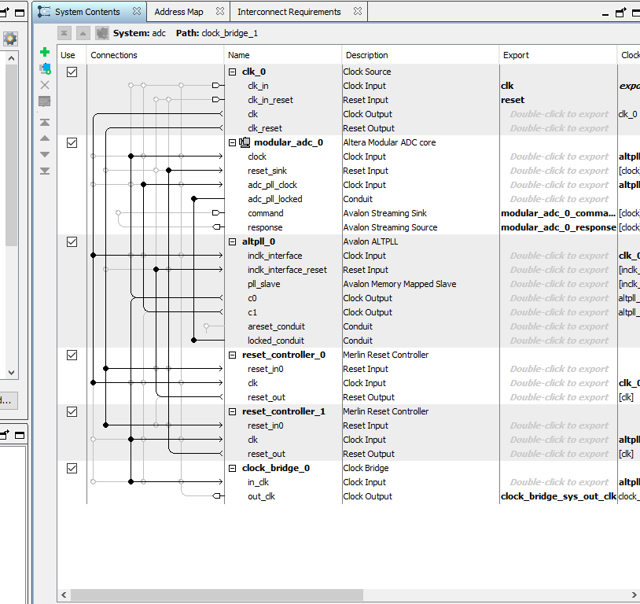
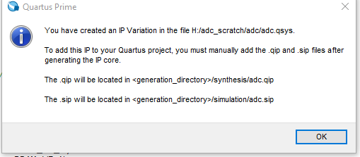

# DE10-ADC
This repository has the hardware description files and a guide for configuring the on-board ADC on DE-series FPGAs for 2MHz sampling rate.

This guide is using Quartus Prime 16.0 and Qsys IP tool, but should also be supported for Platform Designer (formerly Qsys) and a newer version of Quartus.

**FPGA Configuration Information**

The board used for this configuration is the DE10-Lite (10M50DAF484C7G) which has two on-board FPGAs but only ADC0 is used. See the user manual and configuration guide for pin assignments, and ADC configurations if you are using a different board. 

This project uses SW[2:0] for selecting which of the analog inputs the ADC samples from and is shown on HEX5.

The 12 ADC bit values are displayed in hexidecimal format on the HEX3, HEX2, and HEX1 displays.

### Created By New Mexico State University ECE Student

(Updated May 8, 2019)  

 Derrick Rivera

## ADC IP Configuration

This section describes the process of configuring the ADC core control module and necessary PLL.

### Configuring the soft-IP
* Open Qsys or Platform Designer

#### Adding the ADC core
* In the IP Catalog search bar, search for Altera Modular ADC core  

* Double-click it to open the configuration window. Configure it as follows  

* Click Finish
You should now see it in the System Contents tab.
* On the "command" row, export by double-clicking where it says "Double-click to export
* On the "response" row, export by double-clicking where it says "Double-click to export
There should now be names assigned in the Export column.

#### Adding the PLL
* In the IP Catalog search bar, search for Avalon ALTPLL 

* Double-click it to open the configuration window. Configure it as follows  

* Click Finish
You should now see it in the System Contents tab.

#### Adding Reset Controllers
* In the IP Catalog search bar, search for Reset Controller 

* Double-click it to open the configuration window. Configure it as follows  

* Click Finish
You should now see it in the System Contents tab.
* Repeat the last three steps to add another reset controller

#### Adding a Clock Bridge for the System
* In the IP Catalog search bar, search for Clock Bridge

* Double-click it to open the configuration window
* Click Finish
You should now see it in the System Contents tab.
* On the "out_clk" row, export by double-clicking where it says "Double-click to export
There should now be a name assigned in the Export column.

#### Interconnect the devices
* By clicking nodes in the connections column of the Systom Contents tab, make the following connections
(If you accidentally click a node for an exported pin, you will have to re-export by double-clicking as before)

#### Save the Qsys file if you want to modify it later

#### Generate HDL 
* Click the Generate HDL Button at the bottom of the Qsys window
* Click Generate on the popup window
* Close the Qsys tool. You will see the following message

#### Add the .qip file to the project

## Interfacing with the ADC

The ADC interface is I2C, but this project uses a wrapper based on the ADC controller synthesis. The source Verilog is the top-level entitiy of the Quartus project (see adc_2M.v). This is a modified version of the ADC_RTL Template that can be downloaded from Terasic's website.

## Deployment

**Uploading HDL to the FPGA**

The process for programming the FPGA is the standard method using the Quartus Programmer tool and USB Blaster.
